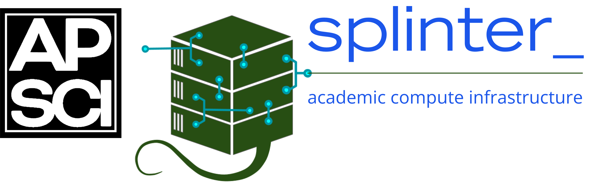

<!-- Improved compatibility of back to top link: See: https://github.com/othneildrew/Best-README-Template/pull/73 -->

<!-- PROJECT SHIELDS -->
<!-- [![Contributors][contributors-shield]][contributors-url]
[![Forks][forks-shield]][forks-url]
[![Stargazers][stars-shield]][stars-url]
[![Issues][issues-shield]][issues-url]
[![GPL License][license-shield]][license-url] -->
[](https://opensource.org/licenses/)
[](https://github.com/acceleratescience/server-infra/issues)
[]()
[]()
[](http://makeapullrequest.com)

<br>
[]()
[]()
[](https://github.com/JonSnow/MyBadges)
[](https://github.com/JonSnow/MyBadges)
[](https://twitter.com/AccelerateSci)
<!-- [![LinkedIn][linkedin-shield]][linkedin-url] -->

> [!WARNING]
> This project is incomplete and under active development. The infrastructure and documentation are subject to significant changes.

<!-- PROJECT LOGO -->
<br />
<div align="center">
  <a>
    
  </a>

  <h3 align="center">Accelerate Science GPU Server Infrastructure</h3>

  <p align="justify">
    Infrastructure-as-code for deploying and managing GPU servers for machine learning research support.
  </p>
  <p align="center">
    <!-- <a href="https://acceleratescience.github.io/diffusion-models/" style="font-size: 20px; text-decoration: none"><strong>Start »</strong></a>
    <br />
    <br /> -->
    <a href="https://github.com/acceleratescience/large-language-models/issues">Report Bug</a>
    ·
    <a href="https://github.com/acceleratescience/large-language-models/issues">Request Feature</a>
    <br />
  </p>
</div>


<!-- TABLE OF CONTENTS -->
<details>
  <summary>Table of Contents</summary>
  <ol>
    <li><a href="#introduction">Introduction</a></li>
    <li><a href="#quick-start">Quick Start</a></li>
    <li><a href="#repository-structure">Repository Structure</a></li>
    <li><a href="#documentation">Documentation</a></li>
    <li><a href="#requirements">Requirements</a></li>
    <li><a href="#license">License</a></li>
  </ol>
</details>


<!---------------------------------------------------------------------------->

[Button Shield]: https://img.shields.io/badge/Shield_Buttons-37a779?style=for-the-badge

[License]: LICENSE
[Shield]: Types/Shield.md
[#]: #


<!---------------------------------[ Badges ]---------------------------------->

[Badge License]: https://img.shields.io/badge/-BY_SA_4.0-ae6c18.svg?style=for-the-badge&labelColor=EF9421&logoColor=white&logo=CreativeCommons
[Badge Likes]: https://img.shields.io/github/stars/MarkedDown/Buttons?style=for-the-badge&labelColor=d0ab23&color=b0901e&logoColor=white&logo=Trustpilot


This repository contains the configuration, deployment scripts, and documentation for running:

- **LLM inference services** (vLLM + LiteLLM proxy)
- **Monitoring stack** (Prometheus + Grafana + DCGM exporter)
- **Workshop environments** (JupyterHub for training sessions)

# Introduction

Our research group found ourselves with a server and a dream: serve large language model endpoints to our community for free, so they could experiment with LLMs. But the path from zero to scalable, robust language model service did not seem to us to be an easy one. We were faced with questions like: What inference engine do we use? How do we manage access? How do we monitor usage? What kind of models can we supply, and how many users can we feasibly serve? How do we assess the quality of our service?

We quickly noticed that this information is scattered about over blog posts, subreddits, tutorial, technical documentation, and tribal knowledge. And in trying to answer these questions, we realised that surely other people must have run into the same problems? No doubt there are pockets of researchers and small business (or even homelab enthusiasts) with their own hardware who were also grappling with the same questions.

In some ways, this repo serves as a call to all those who are doing something similar: here is what we tried? How about you? To others who are in the first stages of this process, we are hoping that this will serve as a useful starting point. Within this repo, we aim to not only provide the software infrastructure to serve LLMs, but also sets of documentation acting as tutorials. Furthermore, we also offer our [Architectural Decision Records](docs/ADRs/) (ADRs), so that people can understand _why_ we made the decisions that we did.

We offer this with the only caveat that many areas may be... suboptimal. If that is the case, then we are open to any well-intentioned feedback or advice in our issues. 

# Quick Start

1. Clone this repository
2. Copy example files and configure for your environment:
```bash
   cp ansible/inventory.ini.example ansible/inventory.ini
   # Edit inventory.ini with your server details
```
3. Run the bootstrap playbook to set up the base system:
```bash
   ansible-playbook -i ansible/inventory.ini ansible/playbooks/setup.yml
```
4. Deploy the monitoring stack:
```bash
   ansible-playbook -i ansible/inventory.ini ansible/playbooks/monitoring.yml
```

# Repository Structure
```
ansible/          # Ansible playbooks for server configuration
docs/             # Documentation and Architecture Decision Records
scripts/          # Operational scripts (mode switching, maintenance)
stacks/           # Docker Compose definitions for each service
```

# Documentation

- [Getting Started](docs/getting-started.md) - Detailed setup instructions
- [System Architecture](docs/system.md) - How the components fit together
- [ADRs](docs/ADRs/) - Architecture Decision Records explaining key choices

# Requirements

- Ubuntu 22.04 LTS (server)
- NVIDIA GPU with recent drivers
- Docker and Docker Compose
- Ansible (on your local machine, for deployment)

# License

GNU GPLv3 - See [LICENSE](LICENSE) for details.

<!-- MARKDOWN LINKS & IMAGES -->
<!-- https://www.markdownguide.org/basic-syntax/#reference-style-links -->
[contributors-shield]: https://img.shields.io/github/contributors/acceleratescience/server-infra.svg?style=for-the-badge
[contributors-url]: https://github.com/acceleratescience/server-infra/graphs/contributors
[forks-shield]: https://img.shields.io/github/forks/acceleratescience/server-infra.svg?style=for-the-badge
[forks-url]: https://github.com/acceleratescience/server-infra/network/members
[stars-shield]: https://img.shields.io/github/stars/acceleratescience/server-infra.svg?style=for-the-badge
[stars-url]: https://github.com/acceleratescience/server-infra/stargazers
[issues-shield]: https://img.shields.io/github/issues/acceleratescience/server-infra.svg?style=for-the-badge
[issues-url]: https://github.com/acceleratescience/server-infra/issues
[license-shield]: https://img.shields.io/github/license/acceleratescience/server-infra.svg?style=for-the-badge
[license-url]: https://github.com/acceleratescience/server-infra/blob/master/LICENSE.txt
[linkedin-shield]: https://img.shields.io/badge/-LinkedIn-black.svg?style=for-the-badge&logo=linkedin&colorB=555
[linkedin-url]: https://linkedin.com/company/accelerate-programme-for-scientific-discovery/
[product-screenshot]: images/screenshot.png
[Next.js]: https://img.shields.io/badge/next.js-000000?style=for-the-badge&logo=nextdotjs&logoColor=white
[Next-url]: https://nextjs.org/
[React.js]: https://img.shields.io/badge/React-20232A?style=for-the-badge&logo=react&logoColor=61DAFB
[React-url]: https://reactjs.org/
[Vue.js]: https://img.shields.io/badge/Vue.js-35495E?style=for-the-badge&logo=vuedotjs&logoColor=4FC08D
[Vue-url]: https://vuejs.org/
[Angular.io]: https://img.shields.io/badge/Angular-DD0031?style=for-the-badge&logo=angular&logoColor=white
[Angular-url]: https://angular.io/
[Svelte.dev]: https://img.shields.io/badge/Svelte-4A4A55?style=for-the-badge&logo=svelte&logoColor=FF3E00
[Svelte-url]: https://svelte.dev/
[Laravel.com]: https://img.shields.io/badge/Laravel-FF2D20?style=for-the-badge&logo=laravel&logoColor=white
[Laravel-url]: https://laravel.com
[Bootstrap.com]: https://img.shields.io/badge/Bootstrap-563D7C?style=for-the-badge&logo=bootstrap&logoColor=white
[Bootstrap-url]: https://getbootstrap.com
[JQuery.com]: https://img.shields.io/badge/jQuery-0769AD?style=for-the-badge&logo=jquery&logoColor=white
[JQuery-url]: https://jquery.com 
