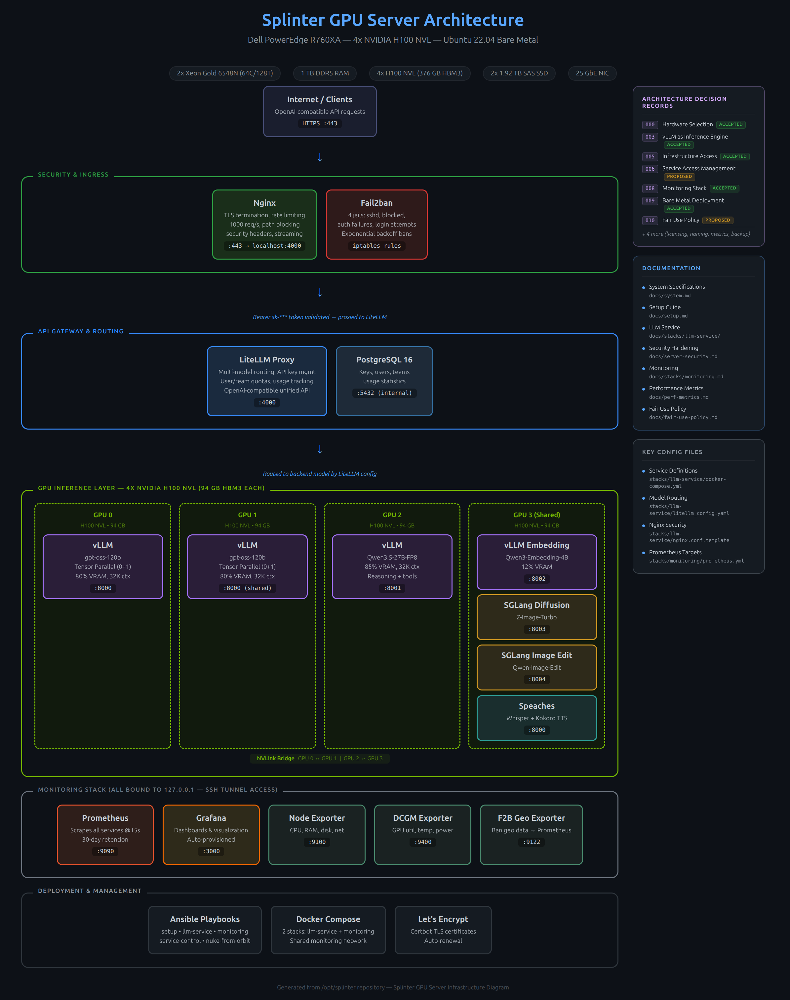

# Product Requirements Document: Splinter LLM Infrastructure

> **Status:** Draft  
> **Author:** R. K. Daniels  
> **Last updated:** 2026.03.28  
> **Version:** 0.1

---

## 1. Executive Summary

Splinter is a self-hosted LLM inference and fine-tuning platform built on GPU server hardware, but the Accelerate Programme for Scientific Discovery. It provides researchers at Cambridge with secure, low-latency access to open-weight language models without dependence on commercial API providers. This document defines the requirements, architecture, and operational model for the platform.

---

## 2. Problem Statement

### 2.1 Context

Describe the environment this product operates in. What does the research landscape look like? What are the constraints (budget, policy, data sensitivity, skills availability)?

### 2.2 Pain Points

What specific problems does Splinter solve? Consider framing these from the perspective of distinct user groups:

- **Researchers:** e.g. API cost unpredictability, data sovereignty concerns, lack of model customisation options
- **IT / Infrastructure teams:** e.g. shadow IT risk from unmanaged GPU cloud usage, no institutional visibility into LLM workloads
- **Leadership / Strategy:** e.g. inability to offer competitive AI research support, dependence on third-party pricing models

### 2.3 Alternatives Considered

Briefly describe what alternatives exist (commercial APIs, cloud GPU providers, managed platforms) and why self-hosted infrastructure was chosen. Be honest about trade-offs.

---

## 3. Goals & Success Criteria

### 3.1 Goals

Define what success looks like in plain terms. e.g.:

- Provide on-demand LLM inference to N concurrent users at P99 latency ≤ Xms
- Support fine-tuning workflows for models up to Y billion parameters
- Achieve Z% uptime during supported hours

### 3.2 Non-Goals

Equally important. Explicitly state what Splinter is *not* trying to do. e.g.:

- Not a general-purpose HPC cluster
- Not intended for training foundation models from scratch
- Not a replacement for [specific existing service]

### 3.3 Success Metrics

| Metric | Target | Measurement Method |
|---|---|---|
| Inference latency (P95) | ≤ X ms | Prometheus / Grafana |
| Concurrent users supported | ≥ N | Load testing |
| Model availability | ≥ 99.X% | Uptime monitoring |
| Time to onboard new model | ≤ X hours | Operational log |
| User satisfaction | ≥ X/5 | Periodic survey |

---

## 4. Users & Personas

### 4.1 Primary Users

Describe who will use the system directly. Include enough detail that someone unfamiliar with your institution can understand the user base.

| Persona | Description | Key Needs |
|---|---|---|
| **Research user** | Postdoc or PhD student using LLMs for their domain (e.g. NLP, bioinformatics, materials science) | Simple API access, good docs, model variety |
| **Power user** | ML-literate researcher who wants to fine-tune or run custom inference pipelines | SSH/CLI access, custom model loading, GPU scheduling |
| **Platform operator** | Engineer responsible for keeping the stack running | Monitoring, alerting, deployment automation, security |

### 4.2 Secondary Stakeholders

- Institutional leadership (reporting, cost justification)
- Information security (compliance, audit)
- Peer institutions looking to replicate (documentation quality)

---

## 5. System Architecture

### 5.1 Hardware

Describe the physical infrastructure. Be specific — this section is particularly useful for replicators.

| Component | Specification |
|---|---|
| Server | [e.g. Dell PowerEdge R760XA] |
| GPUs | [e.g. 4× NVIDIA H100 NVL 94GB] |
| CPU | [e.g. Dual Intel Xeon w/ X cores] |
| RAM | [e.g. X TB DDR5] |
| Storage | [e.g. X TB NVMe local + NFS mount] |
| Network | [e.g. 100GbE, InfiniBand if applicable] |

### 5.2 Software Stack

Describe the logical architecture layer by layer. A diagram is strongly recommended here (link or embed).

```
[Client / Browser]
       │
       ▼
[Reverse Proxy — e.g. nginx]
       │
       ▼
[API Gateway / Router — e.g. LiteLLM]
       │
       ▼
[Inference Engine — e.g. vLLM]
       │
       ▼
[GPU Hardware — e.g. H100 NVL × 4]
```

For each layer, briefly describe:

- **What it does** and why it was chosen
- **Configuration highlights** (e.g. TLS termination at the proxy, model routing logic)
- **Alternatives considered** and why they were rejected

### 5.3 Supporting Services

| Service | Purpose | Tool |
|---|---|---|
| Monitoring | Metrics collection & dashboards | [e.g. Prometheus + Grafana] |
| Logging | Centralised log aggregation | [e.g. Loki, journald] |
| Security | Intrusion detection, rate limiting | [e.g. fail2ban, GeoIP enrichment] |
| Automation | Configuration management & deployment | [e.g. Ansible] |
| Documentation | Operational docs & ADRs | [e.g. MkDocs] |
| Secrets management | API keys, certificates | [e.g. SOPS, Vault, environment files] |

### 5.4 Network & Security Architecture

Describe the network topology, firewall rules, TLS configuration, and authentication model. Include:

- How users authenticate (API keys, institutional SSO, etc.)
- Network segmentation and access controls
- Approach to vulnerability management and patching
- Any compliance frameworks being targeted (e.g. ISO 27001, Cyber Essentials)

---

## 6. Functional Requirements

### 6.1 Inference

| ID | Requirement | Priority |
|---|---|---|
| FR-INF-01 | System shall expose an OpenAI-compatible chat completions API | Must have |
| FR-INF-02 | System shall support concurrent requests from ≥ N users | Must have |
| FR-INF-03 | System shall support streaming responses | Must have |
| FR-INF-04 | System shall allow model selection per request | Should have |
| FR-INF-05 | System shall support structured output / JSON mode | Should have |

### 6.2 Fine-Tuning

| ID | Requirement | Priority |
|---|---|---|
| FR-FT-01 | System shall support LoRA / QLoRA fine-tuning | Must have |
| FR-FT-02 | Users shall be able to upload training data via [method] | Must have |
| FR-FT-03 | System shall track fine-tuning runs with experiment metadata | Should have |

### 6.3 Model Management

| ID | Requirement | Priority |
|---|---|---|
| FR-MM-01 | Operators shall be able to add/remove models without downtime | Must have |
| FR-MM-02 | System shall support quantised models (e.g. AWQ, GPTQ) | Should have |
| FR-MM-03 | System shall maintain a model registry with version history | Nice to have |

### 6.4 Observability

| ID | Requirement | Priority |
|---|---|---|
| FR-OBS-01 | System shall expose request latency, throughput, and error rate metrics | Must have |
| FR-OBS-02 | System shall provide per-user usage tracking | Should have |
| FR-OBS-03 | System shall alert operators on service degradation | Must have |

*Add or remove requirement sections as appropriate for your deployment.*

---

## 7. Non-Functional Requirements

| Category | Requirement |
|---|---|
| **Availability** | Target uptime of X% during supported hours (define hours) |
| **Performance** | P95 time-to-first-token ≤ X ms for [model class/size] |
| **Scalability** | Architecture should support adding GPU nodes without re-architecture |
| **Security** | All traffic encrypted in transit; API keys rotated on [schedule]; logs retained for [period] |
| **Maintainability** | All configuration managed via IaC (e.g. Ansible); changes tracked in version control |
| **Data handling** | No user prompts or completions stored beyond [policy]; compliance with [institutional data policy] |
| **Disaster recovery** | RTO ≤ X hours; RPO ≤ X hours; documented recovery procedure |

---

## 8. Deployment & Operations

### 8.1 Deployment Model

Describe how the system is deployed and updated. Include:

- Deployment tooling (e.g. Ansible playbooks, container images)
- Rollback strategy
- Environment management (dev / staging / prod, if applicable)

### 8.2 Operational Responsibilities

| Responsibility | Owner | Frequency |
|---|---|---|
| OS patching | [Name/Role] | Monthly |
| Model updates | [Name/Role] | As needed |
| Certificate renewal | [Name/Role] | Before expiry / automated |
| Security review | [Name/Role] | Quarterly |
| Capacity planning | [Name/Role] | Quarterly |
| Backup verification | [Name/Role] | Monthly |

### 8.3 Support Model

Define how users get help: ticketing system, Slack channel, office hours, documentation, etc.

---

## 9. Risks & Mitigations

| Risk | Likelihood | Impact | Mitigation |
|---|---|---|---|
| GPU hardware failure | Low | High | [e.g. vendor warranty, spare parts strategy, graceful degradation] |
| Security breach via exposed API | Medium | High | [e.g. fail2ban, rate limiting, network segmentation, GeoIP blocking] |
| Single point of failure (single server) | High | High | [e.g. documented rebuild procedure, IaC, offsite config backup] |
| Key person dependency | Medium | Medium | [e.g. documentation, cross-training, runbooks] |
| Model licensing changes | Low | Medium | [e.g. preference for permissively licensed models] |

---

## 10. Roadmap

### Phase 1: Foundation (Target: [date])

- Core inference stack operational
- Monitoring and alerting in place
- Initial user onboarding

### Phase 2: Hardening (Target: [date])

- Security certification (e.g. Cyber Essentials)
- Automated deployment pipeline
- Fine-tuning workflows available to users

### Phase 3: Scale (Target: [date])

- Multi-node GPU support
- Self-service model onboarding
- Integration with institutional HPC scheduler

*Adjust phases to reflect your actual timeline and priorities.*

---

## 11. Appendices

### A. Architecture Diagram



### B. Decision Log / ADRs

Link to your Architecture Decision Records or summarise key decisions:

| Decision | Date | Rationale |
|---|---|---|
| [e.g. Chose vLLM over TGI] | [Date] | [Brief reason] |
| [e.g. nginx over Caddy] | [Date] | [Brief reason] |

### C. Glossary

Define terms for non-technical readers. e.g.:

TODO

### D. References

TODO

---

*This document is a living artefact. Update it as the system evolves.*