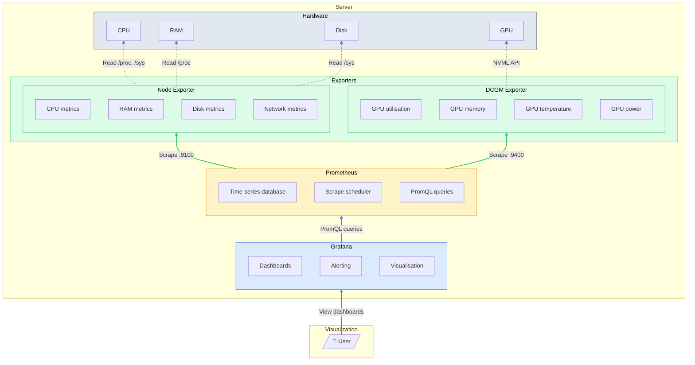

# Monitoring

## Introduction

This guide walks through the monitoring stack for the server. This stack is largely independent of whatever other stacks you're running -- LLM inference, fine tuning, simulation, whatever -- this will help you keep track of and log your hardware sensors. You'll be able to see things like:

- How much storage is being used  
- GPU usage, temperatures, power draw, etc.  
- CPU usage, temperatures, power draw, etc.  
- RAM usage  

### File Structure
All files relevant to this section can be found in the following locations in the tree:
```
splinter/
├── ansible/
│   └── playbooks/
│       └── monitoring.yml
├── scripts/
│   └── monitoring.sh
└── stacks/
    └── monitoring/
        ├── docker-compose.yml
        └── prometheus.yml
```

## Architecture



### Components

| Component | Purpose | Port |
|-----------|---------|------|
| **Node Exporter** | Collects CPU, RAM, disk, and network metrics from the host | 9100 |
| **DCGM Exporter** | Collects GPU metrics via NVIDIA's Data Center GPU Manager | 9400 |
| [**Prometheus**](https://prometheus.io/docs/introduction/overview/) | Scrapes exporters, stores time-series data, provides query interface | 9090 |
| [**Grafana**](https://grafana.com/docs/grafana/latest/) | Visualization dashboards and alerting | 3000 |

## Prerequisites

- Docker and Docker Compose
- NVIDIA Container Toolkit (for GPU monitoring)
- GPU accessible from Docker (`docker run --gpus all` is actually working)

## Component Setup
Like with the server setup, there is a [shell script](../scripts/monitoring.sh) and [ansible playbook](../ansible/playbooks/monitoring.yml). But before working through that, we need to address the different configuration files.

### Exporters

Node Exporter is a Prometheus exporter that collects hardware and OS metrics from Linux systems. It reads from `/proc` and `/sys` to expose metrics on CPU, memory, disk, network, and filesystem usage.

The metrics are exposed at `http://localhost:9100/metrics` in Prometheus format - a simple text-based format that looks like:
```
node_cpu_seconds_total{cpu="0",mode="idle"} 1234567.89
node_cpu_seconds_total{cpu="0",mode="user"} 12345.67
```

Prometheus scrapes this endpoint every 15 seconds (as configured above) and stores the values with timestamps, allowing you to query historical data and build dashboards.

DCGM (Data Center GPU Manager) Exporter is NVIDIA's official Prometheus exporter for GPU metrics. It uses the NVML (NVIDIA Management Library) API to collect detailed GPU telemetry including utilisation, memory, temperature, power draw, and clock speeds.

The metrics are exposed at `http://localhost:9400/metrics`, and look like:
```
DCGM_FI_DEV_GPU_UTIL{gpu="0",UUID="GPU-abc123..."} 87
DCGM_FI_DEV_GPU_TEMP{gpu="0",UUID="GPU-abc123..."} 72
```

For multi-GPU systems, each metric is labelled with the GPU index and UUID, allowing you to monitor each card individually.

### Prometheus Configuration

Let's first checkout the [Prometheus configuration file](../stacks/monitoring/prometheus.yml). Thankfully, it's quite short.

```yaml
global:
  scrape_interval: 15s

scrape_configs:
  # CPU & RAM
  - job_name: 'system-stats'
    static_configs:
      - targets: ['node-exporter:9100']

  # GPU
  - job_name: 'gpu-stats'
    static_configs:
      - targets: ['dcgm-exporter:9400']
```

Prometheus scrapes metrics from the exporters at regular intervals and stores them as time-series data. `scrape_interval` defines how often Prometheus pulls metrics from each target. The `scrape_configs` that follow simply apply labels to the host metrics and GPU metrics.

### The docker compose file

```yaml
version: '3.8'

services:
  # NVIDIA DCGM Exporter
  dcgm-exporter:
    image: nvcr.io/nvidia/k8s/dcgm-exporter:3.3.5-3.4.1-ubuntu22.04
    container_name: monitoring-gpu
    restart: always
    environment:
      - NVIDIA_VISIBLE_DEVICES=all
      - NVIDIA_DRIVER_CAPABILITIES=compute,utility,video
    ports:
      - "127.0.0.1:9400:9400"
    deploy:
      resources:
        reservations:
          devices:
            - driver: nvidia
              count: all
              capabilities: [gpu]
```

The image is pulled from NVIDIA's container registry (nvcr.io) rather than Docker Hub. The `deploy.resources.reservations` block grants the container access to all GPUs via the NVIDIA Container Toolkit - this is the Docker Compose equivalent of `docker run --gpus all`. The environment variables ensure all GPUs are visible and that the container has the necessary driver capabilities for monitoring. Port 9400 exposes the metrics endpoint that Prometheus scrapes. If you only wanted to scrape data from one or two GPUs, you would change the `count` variable.

```yaml
  node-exporter:
    image: prom/node-exporter:latest
    container_name: monitoring-node
    restart: always
    volumes:
      - /proc:/host/proc:ro
      - /sys:/host/sys:ro
      - /:/rootfs:ro
    command: 
      - '--path.procfs=/host/proc' 
      - '--path.sysfs=/host/sys'
      - '--collector.filesystem.mount-points-exclude=^/(sys|proc|dev|host|etc)($$|/)'
    ports:
      - "127.0.0.1:9100:9100"
```

Node Exporter needs access to the host's filesystem to collect system metrics, so we have to mount `/proc`, `/sys`, and the root filesystem as read-only volumes. The command arguments tell Node Exporter where to find these mounted paths inside the container. The `--collector.filesystem.mount-points-exclude` regex filters out virtual filesystems and container mounts that would otherwise clutter the metrics with irrelevant data. The `$$` is Docker Compose syntax for escaping a literal `$` in the regex.

```yaml
  # Prometheus
  prometheus:
    image: prom/prometheus:latest
    container_name: monitoring-prom
    restart: always
    ports:
      - "127.0.0.1:9090:9090"
    volumes:
      - ./prometheus.yml:/etc/prometheus/prometheus.yml
      - prometheus_data:/prometheus
    command:
      - '--config.file=/etc/prometheus/prometheus.yml'
      - '--storage.tsdb.path=/prometheus'
      - '--storage.tsdb.retention.time=30d'
```

Prometheus uses two volume mounts: the first binds our local `prometheus.yml` configuration file into the container, and the second creates a named volume for persistent storage of the time-series database. Without the `prometheus_data` volume, you'd lose all historical metrics whenever the container restarts. Port 9090 exposes both the web UI and the query API that Grafana connects to. We also override the command and pass in a data rentention flag to keep data for 30 days before being overwritten.

And finally

```yaml
  # Grafana
  grafana:
    image: grafana/grafana:latest
    container_name: monitoring-grafana
    restart: always
    ports:
      - "127.0.0.1:3000:3000"
    volumes:
      - grafana_data:/var/lib/grafana

volumes:
  prometheus_data:
  grafana_data:
```

Grafana's named volume persists dashboards, data sources, and user settings across container restarts. Port 3000 exposes the web UI where you can build and view dashboards. The `volumes` block at the bottom declares both named volumes used in the stack - Docker Compose creates these automatically on first run and maintains them independently of the container lifecycle.

> [!NOTE]
> All ports are bound to 127.0.0.1 (localhost). This effectively locks down the stack, making the services invisible to the outside world. Access is intended to be handled via an SSH tunnel, ensuring all monitoring traffic is encrypted and secure.

### The launch script

The final stage is to check out the [llm service launch script](../scripts/monitoring.sh). Again, there is an [ansible equivalent](../ansible/playbooks/monitoring.yml). This script deploys the entire stack.

```bash

set -euo pipefail

# Determine script and stack directories
SCRIPT_DIR="$(cd "$(dirname "${BASH_SOURCE[0]}")" && pwd)"

# Check if we're running from the scripts directory or the stack directory
if [[ "$(basename "$SCRIPT_DIR")" == "scripts" ]]; then
    # Running from repo root via ./scripts/monitoring.sh
    REPO_ROOT="$(cd "${SCRIPT_DIR}/.." && pwd)"
    STACK_DIR="${REPO_ROOT}/stacks/monitoring"
else
    # Running directly from stack directory
    STACK_DIR="$SCRIPT_DIR"
fi
```
This part is similar to the setup -- we are making sure the script exits if something fails. We also figure out where it's being run from so it can find the stack directory. This lets you run it either from the repo root (`./scripts/monitoring.sh`) or directly from the stack directory.

The first proper stage is the preflight checks:

```bash
# ==================== Pre-flight Checks ====================
echo "[1/6] Running pre-flight checks..."

# Check Docker is running
if ! systemctl is-active --quiet docker; then
    echo "ERROR: Docker is not running"
    echo "Start it with: sudo systemctl start docker"
    exit 1
fi
echo "      Docker: OK"

# Check NVIDIA Container Toolkit
if ! docker info --format '{{.Runtimes}}' | grep -q nvidia; then
    echo "ERROR: NVIDIA Container Toolkit not configured"
    exit 1
fi
echo "      NVIDIA runtime: OK"

# Test GPU access
if ! command -v nvidia-smi &> /dev/null || ! nvidia-smi > /dev/null 2>&1; then
    echo "ERROR: Cannot access GPU (nvidia-smi failed)"
    exit 1
fi
echo "      GPU access: OK"

# Check stack directory exists
if [ ! -f "${STACK_DIR}/docker-compose.yml" ]; then
    echo "ERROR: docker-compose.yml not found at ${STACK_DIR}"
    exit 1
fi
echo "      Stack files: OK"
```

The script validates four dependencies before attempting deployment: Docker daemon is running, NVIDIA Container Toolkit is registered as a Docker runtime, GPUs are accessible from within a container, and the required Compose files exist. Each check provides a specific error message to help diagnose failures.

```bash
# ==================== Deploy Stack ====================
echo ""
echo "[2/6] Pulling latest Docker images..."
cd "${STACK_DIR}"
docker compose pull

echo ""
echo "[3/6] Starting monitoring stack..."
docker compose up -d
```

The script pulls images before starting containers, ensuring you're running the latest versions. The `-d` flag runs containers in detached mode. Pretty straight forward.

And finally,

```bash
# ==================== Health Checks ====================
echo ""
echo "[4/6] Waiting for Prometheus..."
for i in {1..12}; do
    if curl -sf http://localhost:9090/-/ready > /dev/null 2>&1; then
        echo "      Prometheus: OK"
        break
    fi
    if [ $i -eq 12 ]; then
        echo "      Prometheus: TIMEOUT (check logs with: docker logs monitoring-prom)"
    fi
    sleep 5
done

echo "[5/6] Waiting for Grafana..."
for i in {1..12}; do
    if curl -sf http://localhost:3000/api/health > /dev/null 2>&1; then
        echo "      Grafana: OK"
        break
    fi
    if [ $i -eq 12 ]; then
        echo "      Grafana: TIMEOUT (check logs with: docker logs monitoring-grafana)"
    fi
    sleep 5
done

echo "[6/6] Checking exporters..."
if curl -sf http://localhost:9100/metrics > /dev/null 2>&1; then
    echo "      Node Exporter: OK"
else
    echo "      Node Exporter: FAILED"
fi

if curl -sf http://localhost:9400/metrics > /dev/null 2>&1; then
    echo "      DCGM Exporter: OK"
else
    echo "      DCGM Exporter: FAILED"
fi
```

The script polls Prometheus and Grafana's health endpoints with a 60-second timeout (12 attempts × 5 seconds), giving slower systems time to start. The exporters get a single check since they start quickly. The `curl -sf` flags suppress progress output and return non-zero on HTTP errors.

## Dashboards

The next stage is to hook up the data sources with Grafana and monitor the hardware.

#TODO