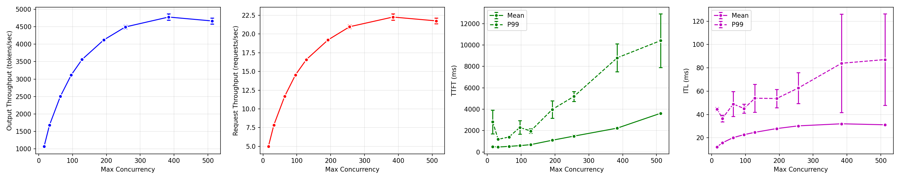
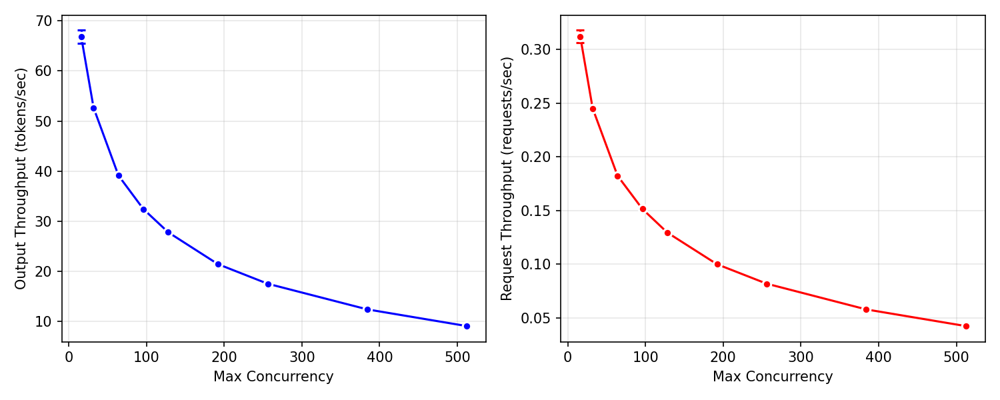

# LLM Performance Metrics

## Introduction
The primary purpose of this server is to deliver free and open source LLMs to the Cambridge community. We have limited hardware, and we therefore need to extract as much performance as possible out of it, in order to serve as many users as possible.

This document represents the learnings from benchmarking our system to optimize for different use cases. We are not talking about the performance of the LLM in doing different tasks; instead, we are looking at answering some key physical questions about our server:

**How many people can we reasonably serve at a reasonable quality of service?**

This question is actually more complicated to answer than you might think, and it starts with asking the question: what is the intended use case of the LLM service?

At first, we wanted to exlude people prototyping business ideas, or building ChatGPT clones, and prioritize throughput -- stuffing as many requests through the model as possible. But then we realized that this is not ideal for researchers wanting to build agentic systems, or legitimate uses of a chat application.

A reasonable compromise would be: the user experience should be fine for people wanting to develop agentic systems or chat applications, but throughput should still be as high as possible.

We also have to be willing to accept that for most people, the experience will be fine, but for the 1-in-100, they will occasionally get a poor experience occasionally.

So we want to know ultimately:

1. what is the theoretical maximum number of prompts we can process in some given timeframe (usually one second)
2. What is the maximum number of people that we can serve and maintain a decent latency for most of the users.

Based on this information, we would know how to adjust our rate limits. First, we need to understand what _latency_ and _throughput_ actually mean. First, just a brief overview of the different stages of generation.

## Stages of inference
After the user packages up their prompt into a request, a number of things happen sequentially:

1. **Queuing** The prompt joins a queue for processing
2. **Prefill** The prompt tokens are run through the model layers, and the KV cache is filled for these tokens. This is compute bound, and usually very fast on something like an H100. The result of this process is the first token.
3. **Decode** The LLM must now output a response, one token at a time. This process is memory bound, because to generate a single token, the GPU must read the parameters and the KV cache from the HBM into the compute cores. And it has to do this _every_ time it generates a token.

When first digging in to these things, it feels sort of like trying to tune a car while driving it -- there are so many different metrics that are related, and you might want to optimize for one or the other based on use cases! All of the different variables are fighting for the same limited resource: **GPU memory**.

In vLLM, the model weights take up a permanent amount of memory, and the rest is allocated for the KV Cache. You can think of two dimensions of the KV cache allocation: one is for context size, and the other is for max concurrency, but the volume remains fixed so that you cannot increase one without decreasing the other. In other words, if we increase the context size, we can have few concurrent users.

An important thing to remember is that changing the context size requires a server restart, so we will first fix context size, or `max-model-len`. We then look at how many people we can feasibly serve with this context size, and we can always adjust later.

## vLLM Bench

To benchmark our system, we will use vLLM Benchmarking. It is not the only benchmarking framework. Another popular alternative is `genai-perf` from NVIDIA, but this involves downloading the Triton Inference Server SDK, which we don't want to do.

vLLM exposes a number of parameters and a number of bench metrics. We briefly discuss some of them here.

### Metrics

`request_rate` How many messages are being sent to the endpoint in a one second period. vLLM does not typically send all requests at once, but introduces an element of burstiness which follows a Poisson process. Ideally, we want to test our system in the worst case scenario, when all messages are sent **at once**.

`max_concurrency` Sort of like the batch size -- how many prompts are being processed at one time.

`request_throughput` How many prompts can we get through in a one second period.

`output_throughput` How many tokens can we pump out in a one second period.

`ttft` The time to first token is the time it takes to start generating tokens. This is essentially the _prefill_ stage. Users will get annoyed if they have to wait a long time for this. This comes in two flavours: the mean, and the p99, a value saying that 99 percent of users got a better score than this. It represents the worse case scenario.

`itl` The intertoken latency is the amount of time between token generations. This also comes in mean and p99.

`tpot` The time per output token is the amount of time it takes to generate each token. This also comes in mean and p99.

### Parameters
Here are the ones we care about:

`--max-concurrency` The maximum number of prompts we're going to try and process.

`--num-prompts` The number of prompts we send to the model. We can only ever send this number as a maximum, so it should be higher than the `--max-concurrency`, so that we don't run into an artifical ceiling

`--request-rate` The number of requests to send to the endpoint. We make this essentially infinite.

### The sweep

So we want to try and find our worst case scenario. So we will iterate over `--max-concurrency`. The script can be found at [link](link).

In order to determine our limits we make four plots:

#### 1. Token throughput

x-axis: `max_concurrency`
y-axis: `output_throughput`

This will tell us our theoretical ceiling of how many raw tokens we can spit out the model per second.

#### 2. Request throughput

x-axis: `max_concurrency`
y-axis: `request_throughput`

This will tell us our theoretical ceiling of how many raw request we can push through the model per second.

We can normalize these by the concurrency to get a sort of "per user" throughput.

#### 3. User experience -- TTFT

x-axis: `max_concurrency`
y-axis: `mean_ttft_ms`
y-axis: `p99_ttft_ms`

This will tell us at what point the prefill phase starts to impact user experience. If users are waiting longer than a few seconds, this gets to be annoying

#### 4. User experience -- ITL

x-axis: `max_concurrency`
y-axis: `mean_itl_ms`
y-axis: `p99_itl_ms`

This will tell us our ITL ceiling. This typically plateaus, because during decode, the GPU is doing the same work regardless of how many users are batched together. The process is:

- Load model weights from HBM → compute cores
- Load KV cache from HBM → compute cores
- Compute next token for all concurrent requests at once
- Write results back

The weight loading (step 1) is the expensive part -- and it's amortised across all requests in the batch. Whether you're generating tokens for 16 users or 256 users, you load the weights once per forward pass. Since decode is memory-bandwidth bound, not compute bound, the GPU spends most of its time waiting for data to arrive from HBM, not actually doing maths.

When you start batching:

- 1 user: Load weights, compute 1 token
- 256 users: Load weights, compute 256 tokens

Same memory bandwidth cost, 256× more useful work. So ITL barely changes - each user's token still takes ~30ms because that's how long the memory transfer takes, but everyone gets their token in that same 30ms window.

TTFT doesn't scale the same way, because prefill is compute bound, not memory bound. Each user's input prompt requires its own matrix multiplications. More users = more compute = queuing = longer TTFT.

### Results

Below is an example plot using `gpt-oss-120b` on 2x H100 94GB PCIe.



We seem to be hitting a ceiling of just over 4,500 tok/s, at just under 400 concurrent requests, and about 22.5 req/s. The TTFT is pretty reasonable, hitting ~1 sec at about 200 users. The p99 is pretty telling though -- at 200 users, it jumps up to 4 sec. The ITL remains stable at ~30ms.

If we normalize the first two plots, we can see that for 16 users we can get ~70 tok/s. [An informal poll on the LocalLLaMa subreddit](https://www.reddit.com/r/LocalLLaMA/comments/162pgx9/what_do_yall_consider_acceptable_tokens_per/) suggests that around 10-20 tok/s is acceptable. We can see that we hit this value as we get up 200 concurrent requests, and remain > 10 close to 500 concurrent users.



This is very good for a chat application, but what about batching? At 16 concurrent requests, we can see that it takes around 3 seconds to process a single request. Or in other words, for one user, they can process 16 requests in 3 seconds. For single user to process 500 simultaneous requests, they would be looking at ~20 seconds. This is great...for one users. But what if 50 users want to process 500 requests...? That's probably going to be a lot worse.

vLLM also reports the following information on startup:

```bash
Available KV cache memory: 47.94 GiB
GPU KV cache size: 1,396,368 tokens
Maximum concurrency for 8,128 tokens per request: 171.63x
```

This is somewhat in line with what we're seeing in the plots -- as we get to ~200 concurrent requests, latency degrades quickly as a queue begins to form.

### Recommendations

Based on these results:

| Parameter | Value | Rationale |
|-----------|-------|-----------|
| `max-num-seqs` | 250 | 95% of peak throughput, P99 TTFT under 6s |
| Per-user rate limit | 120 req/min | Generous for interactive use, GPU is the real limiter |
| Per-user concurrency | 5 | Prevents single user monopolising capacity |

At these settings, we expect to comfortably serve 50-100 concurrent active users with acceptable latency for most requests.

For batch requests, if the batch size is quite serious, then we should think about a separate service.

> [!NOTE]
> These benchmarks represent worst-case scenarios with all requests arriving simultaneously. Real-world performance will typically be better due to natural variance in request timing. We benchmark the worst case to ensure acceptable performance during usage spikes.
