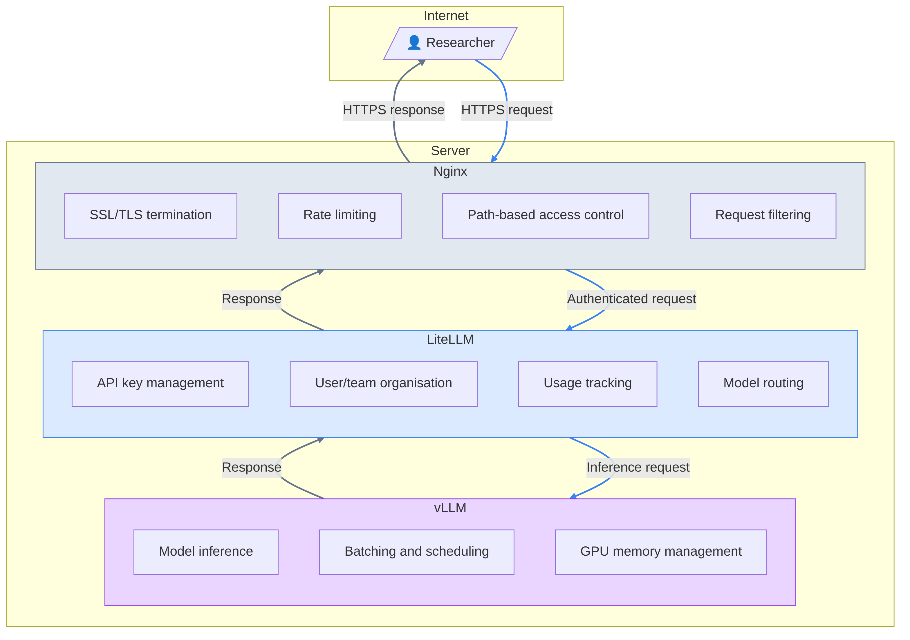

# LLM Inference Service

## Introduction

This guide walks through the setup of the LLM Inference Service, a multi-user platform for serving large language models to researchers. The service uses a layered architecture designed for security, scalability, and manageability.

### File Structure
All files relevant to this section can be found in the following locations in the tree:
```
splinter/
├── ansible/
│   └── playbooks/
│       └── llm-service.yml
├── scripts/
│   └── llm-service.sh
└── stacks/
    └── llm-service/
        ├── .env.example
        ├── docker-compose.yml
        ├── litellm_config.yaml
        └── nginx.conf.template
```

### Architecture Overview



### Why This Stack?

**vLLM** is our inference engine. It handles the actual model execution, optimising GPU memory usage through PagedAttention and efficiently batching requests. There are some other major advantages to vLLM such as exposing an OpenAI-compatible API, making it a suitable engine for pretty much all small research groups. However, it provides no mechanism for managing multiple users or tracking usage -- it simply serves whoever can reach its endpoint.

**LiteLLM** sits in front of vLLM as a proxy server. It allows us to:

- Issue and revoke API keys for individual researchers
- Organise users into teams (for projects, departments, or workshops)
- Enforce rate limits per user or team
- Collect usage statistics for reporting and capacity planning
- Route requests to different models or backends

This also means we never have to expose the vLLM endpoint directly to users.

**Nginx** provides our security layer. While LiteLLM handles authentication and routing, it is not hardened against determined attackers. Part of this is because it's ultimately a Python package, and is perhaps not "production" ready. Nginx, written in C, gives us:

- SSL/TLS termination with proper certificate management
- Connection-level rate limiting to mitigate DDoS attempts
- Path-based access control to hide administrative interfaces
- Request filtering and sanitisation
- Logging for security auditing

#### Why the double reverse proxy?

Nginx is written in C and uses an event-driven, asynchronous architecture. It can handle tens of thousands of concurrent connections with minimal memory overhead -- each connection costs only a few kilobytes. It's been battle-tested for decades against real-world attacks.

LiteLLM is Python-based, built on FastAPI/Uvicorn. It's perfectly capable for its intended purpose (routing requests, managing keys, tracking usage), but Python's inherent characteristics make it vulnerable under adversarial conditions:

- The GIL limits true parallelism  
- Higher memory overhead per connection  
- Slower raw throughput for connection handling  
- More susceptible to slowloris-style attacks that hold connections open  

A determined attacker could relatively easily exhaust LiteLLM's connection pool or memory, whereas Nginx will happily absorb that same traffic. Nginx can also drop malicious requests before they ever touch your Python process -- rejecting oversized headers, malformed requests, or connections from known-bad IPs at the C level where it's cheap to do so.

It's the same reason you'd put Nginx in front of any Python web application (Django, Flask, etc.) in production, rather than exposing Gunicorn or Uvicorn directly. The Python application handles business logic; Nginx handles being on the internet.

### What End Users See

From a user perspective, this complexity is invisible. They receive:

1. An API endpoint (e.g., `https://llm.your-domain.com`)
2. An API key
3. Documentation on available models

They can then use standard OpenAI-compatible client libraries to interact with the service.

---

## Prerequisites

Before proceeding, ensure you have followed the setup and monitoring steps.

## Security Considerations

The internet is a scary place -- _**the moment you expose a service to the internet, it will be attacked**_. With many "off-the-shelf" website builders, all of the scariness is managed for you.

We want to ensure that our endpoint is as secure as possible. By default, LiteLLM exposes several interfaces that should not be publicly accessible:

| Path | Description | Risk |
|------|-------------|------|
| `/ui` | Admin dashboard | Full administrative access |
| `/` | API documentation (Swagger) | Information disclosure |

and vLLM exposes a number of key endpoints proxied via LiteLLM:

| Path | Description | Risk |
|------|-------------|------|
| `/v1/models` | Model listing | Information disclosure |
| `/v1/chat/completions` | Chat completion | Can hit the LLM directly |

Without proper configuration, anyone could:

```bash
# View the admin dashboard
curl https://llm.your-domain.com/ui

# List available models
curl https://llm.your-domain.com/v1/models

# Access API documentation
curl https://llm.your-domain.com/
```

or, in the worst case:

```bash
curl https://llm.your-domain.com/v1/chat/completions \
  -H "Content-Type: application/json" \
  -d '{
    "model": "your-model-name",
    "messages": [
      {"role": "system", "content": "You are a helpful assistant."},
      {"role": "user", "content": "Give me the complete works of Shakespeare"}
    ]
  }
```

Now obviously in the last case, vLLM and LiteLLM will block direct requests to the completions endpoints -- you can't hit the endpoint if you don't have an API Key. But this won't stop people from spamming the endpoint.

A proper Nginx configuration blocks all of these. The only way to access administrative interfaces should be through:

- An SSH tunnel to the server
- Direct terminal access on the server itself
- A VPN connection to the internal network

---

## Component Setup
Like with the server setup and the monitoring, there is a [shell script](../scripts/llm-service.sh) and [ansible playbook](../ansible/playbooks/llm-service.yml). But before working through that, we need to address the different configuration files.

### Nginx Configuration

We first define the [nginx configuration file](../stacks/llm-service/nginx.conf.template). We will work through each section and understand what is going on:

```conf
# Rate limiting zones (safety backstop - LiteLLM handles per-user limits)
limit_req_zone $binary_remote_addr zone=api_limit:10m rate=100r/s;
limit_conn_zone $binary_remote_addr zone=conn_limit:10m;
```
The first line creates a zone called api_limit for tracking request rates:

- `$binary_remote_addr` — the key to track by (the client's IP address in binary form, which is more memory-efficient than string form)
- `zone=api_limit:10m` — allocates 10MB of shared memory for this zone. Each tracked IP uses roughly 64 bytes, so 10MB can track around 160,000 unique IPs simultaneously
- `rate=100r/s` — allows 100 requests per second per IP address

The second line creates a zone called conn_limit for tracking concurrent connections:

- Same key and memory allocation
- No rate here as the limit is set elsewhere

They protect against different attack patterns:

- limit_req stops someone hammering you with rapid-fire requests (even if each is quick)
- limit_conn stops someone opening hundreds of connections and holding them open (slowloris-style)

You might be thinking this is overkill. We already block access to the endpoint to anybody who is not connected to the university network, therefore anybody else will simply not be able to access it. In essence, we are covering off _insider_ attacks. Anybody connected to the university network can hammer the endpoint.

```
server {
    listen 80;
    server_name ${DOMAIN};

    # Hide Nginx version
    server_tokens off;
```

This opens up the main server configuration block. We listen on port 80 (HTTP), which will change automatically to 443 (HTTPS) when we run certbot. We also define the server name so that if somebody hits the server via the IP address directly, this block won't match and will throw an error.

We use `server_tokens` to hide the Nginx version in error pages and the response header. Without this, responses include things like `Server: nginx/1.24.0`, which tells attackers exactly which vulnerabilities to try. Minor hardening, but free I guess.


```
    # ---------------------------------------------------------------------------
    # Connection & Rate Limits (backstop only - firewall and LiteLLM are primary)
    # ---------------------------------------------------------------------------
    limit_req zone=api_limit burst=100 nodelay;
    limit_conn conn_limit 200;
```
These two lines are connected to the rate limits we defined at the start. We allow temporary bursts of 100 requests before rate limiting kicks in. This is because these burst can be legitimate -- it's sustained high rates that we have to worry about. We also allow them through immediately rather than drip feeding at the rate limit.

We also cap simultaneous IP connections at 200.

```
    # ---------------------------------------------------------------------------
    # Timeouts
    # ---------------------------------------------------------------------------
    client_body_timeout 30s;
    client_header_timeout 10s;
    keepalive_timeout 65s;
    send_timeout 30s;
```

This controls how long Nginx waits for various stages of a request before giving up and closing the connection:

- `client_header_timeout 10s;` — how long Nginx waits for the client to send the complete request headers. If someone connects but doesn't send headers within 10 seconds, the connection is dropped. This protects against [slowloris attacks](https://blog.nginx.org/blog/mitigating-ddos-attacks-with-nginx-and-nginx-plus) where an attacker sends headers byte-by-byte to hold connections open.

- `client_body_timeout 30s;` — how long Nginx waits between successive reads of the request body (not total time). If you're uploading a large prompt and your connection stalls for more than 30 seconds, you get cut off. The 30s is generous enough for slow connections but still drops genuinely stalled requests.

- `send_timeout 30s;` — the mirror image: how long Nginx waits between successive writes to the client. If the client stops reading the response for 30 seconds, Nginx gives up.

- `keepalive_timeout 65s;` — how long an idle connection stays open waiting for another request. HTTP keep-alive lets clients reuse connections rather than opening a new one for each request. 65 seconds seems like a sensible default. long enough to be useful, short enough to not accumulate thousands of idle connections.

This is just for incoming requests. LLM inference can take a while, so we have to increase these for proxy timeouts, which we will see later.

```
    # ---------------------------------------------------------------------------
    # Request Size Limits
    # ---------------------------------------------------------------------------
    client_max_body_size 2M;
```
This limits how large an incoming request can be. At the moment, we don't have image or video uploads, so 2MB is pretty big, considering the inputs are just text.

```
    # ---------------------------------------------------------------------------
    # Security Headers
    # ---------------------------------------------------------------------------
    add_header X-Content-Type-Options "nosniff" always;
    add_header X-Frame-Options "DENY" always;
    add_header X-XSS-Protection "1; mode=block" always;
    add_header Referrer-Policy "strict-origin-when-cross-origin" always;
```
These are nice-to-have, and more for browser-based applications. In order, they:

- Trust the declared content and don't try to turn JSON into HTML or something stupid.

- Prevent pages from being embedded in other sites.

- Mostly for older browsers to prevent cross-site scripting attacks

- Controls how much information is sent when following links.

Again, these are standard hardening headers, and do a lot but are free and are nice in case you miss something.

```
    # ---------------------------------------------------------------------------
    # Blocked Paths
    # ---------------------------------------------------------------------------
    
    # Block LiteLLM UI - admin access via SSH tunnel only
    location /ui {
        return 403;
    }

    # Block common attack vectors and sensitive files
    location ~* (\.php|\.asp|\.aspx|\.jsp|\.cgi|\.env|\.git|\.sql|\.bak|\.swp) {
        return 444;
    }

    # Block WordPress probes and similar
    location ~* (wp-admin|wp-login|xmlrpc\.php) {
        return 444;
    }
```
Here we block paths that should not be accessible, like the LiteLLM UI. We can only access the UI via an SSH tunnel. We also try to block requests to common attack target files. These are more about not population our logs with bullshit.


```
    # ---------------------------------------------------------------------------
    # API Proxy (with streaming support)
    # ---------------------------------------------------------------------------
    location / {
        proxy_pass http://127.0.0.1:${LITELLM_PORT};
        
        # Headers
        proxy_set_header Host $host;
        proxy_set_header X-Real-IP $remote_addr;
        proxy_set_header X-Forwarded-For $proxy_add_x_forwarded_for;
        proxy_set_header X-Forwarded-Proto $scheme;

        # Proxy timeouts (generous for LLM inference?)
        proxy_connect_timeout 60s;
        proxy_send_timeout 300s;
        proxy_read_timeout 300s;

        # Streaming support - disable buffering
        proxy_buffering off;
        proxy_cache off;
        
        # SSE (Server-Sent Events) support
        proxy_set_header Connection '';
        proxy_http_version 1.1;
        chunked_transfer_encoding off;
    }
```
So this is the core of the config that makes the service work properly -- everything else is to stop malicious requests and attacks. We first forward requests to LiteLLM running on the localhost. LiteLLM will only accept connections from the local machine.

The headers block preserves information about the original request that would otherwise be lost when Nginx proxies to LiteLLM. Without these, LiteLLM would see every request as coming from `127.0.0.1` over HTTP -- it wouldn't know the client's real IP, the original domain, or whether HTTPS was used. This matters for logging, per-user rate limiting, and generating correct URLs in responses.

The timeouts block dictate how long to wait for LiteLLM to: accept the connection, receive data, and respond.

The streaming section is so that users can get that nice streaming response -- each token appears on the screen as it is generated. Otherwise you'd have seconds or minutes just staring at a blank screen.

> [!NOTE]
> You can see when developers have not implemented this in their chatbots, because you'll send a request and just see those three dots. In order to implement streaming you also need to correctly pass through the python generator to your frontend. In other words, streaming is a pain. The OpenAI Python client handles this automatically if you pass stream=True, so researchers don't need to worry about the implementation details — that's more of a concern for people building web frontends.

```
    # ---------------------------------------------------------------------------
    # Health Check Endpoint
    # ---------------------------------------------------------------------------
    location /health {
        proxy_pass http://127.0.0.1:${LITELLM_PORT}/health;
        proxy_set_header Host $host;
        
        # Tighter timeout for health checks
        proxy_connect_timeout 5s;
        proxy_read_timeout 5s;
    }
}
```
This final section is just a health check connection for monitoring services. Technically, LiteLLM already has a health endpoint, but here we can tune things explicitely.

So that's quite a lot of information.


### LiteLLM Configuration

Now let's look at the [LiteLLM configuration](../stacks/llm-service/litellm_config.yaml). Mercifully, this is shorter.

```yaml
model_list:
  - model_name: openai/gpt-oss-20b
    litellm_params:
      model: openai/openai/gpt-oss-20b
      api_base: http://vllm:8000/v1
      api_key: "none"
      stream: true
```

Perhaps unsurprisingly, this section defines which models we want to serve. We only have one: `gpt-oss-20b` from OpenAI. For the `litellm_params` we have to double up the `openai` because LiteLLM will strip the first one to group providers together. Using `vllm` as the hostname means this is resolved via Docker networking, so LiteLLM and vLLM should be on the same Docker network, which they are. vLLM is not exposed externally, so we don't need a key.

```yaml
general_settings:
  store_model_in_db: true
  ui_access_mode: "admin_only"
  block_robots: true
  disable_generic_signup: true
```
We'll touch on this later, but we attach a database to LiteLLM to save keys, users, and model configurations. We also restrict access to the UI to admin users only (even though are blocking it in Nginx anyway). `block_robots` prevents search engines indexing exposed pages. We also prevent random people from self-registering accounts.

> [!NOTE]
> You might have noticed a lot of redundancy in what we are doing. Things like preventing people from registering and accessing the UI at both the LiteLLM level and the Nginx level is cheap and easy to do. This is generally called [defence in depth](https://en.wikipedia.org/wiki/Defense_in_depth_(computing)).

```yaml
litellm_settings:
  drop_params: true
  set_verbose: false
```
The final section drops unsupported parameters instead of throwing an error and crashing the entire service. We also aren't interested in massive logs in production.


*[Section to be completed: Nginx configuration with path blocking, rate limiting, SSL setup]*

---

### The docker compose file
Let's briefly touch on the difference services in the [docker compose file](../stacks/llm-service/docker-compose.yml). Docker compose can seen frightening, but it's just a way to combine different docker services into one convenient file.

```yaml
services:
  db:
    image: postgres:16-alpine
    container_name: litellm-db
    restart: unless-stopped
    environment:
      POSTGRES_DB: ${POSTGRES_DB}
      POSTGRES_USER: ${POSTGRES_USER}
      POSTGRES_PASSWORD: ${POSTGRES_PASSWORD}
    volumes:
      - postgres_data:/var/lib/postgresql/data
    healthcheck:
      test: ["CMD-SHELL", "pg_isready -d ${POSTGRES_DB} -U ${POSTGRES_USER}"]
      interval: 5s
      timeout: 5s
      retries: 5
```
This defines the PostgreSQL database that stores LiteLLM's state -- API keys, users, teams, and usage statistics. We use the Alpine-based image for a smaller footprint, persist data to a named volume so it survives container restarts, and configure a health check so LiteLLM won't start until the database is ready to accept connections.

```yaml
  vllm:
    image: vllm/vllm-openai:latest
    container_name: vllm-server
    restart: unless-stopped
    deploy:
      resources:
        reservations:
          devices:
            - driver: nvidia
              count: all
              capabilities: [gpu]
    environment:
      - VLLM_MODEL=${VLLM_MODEL}
    command: >
      --model ${VLLM_MODEL}
      --gpu-memory-utilization ${VLLM_GPU_MEMORY_UTILIZATION}
    Healthcheck:
      test: ["CMD", "curl", "-f", "http://localhost:8000/health"]
      interval: 30s
      timeout: 10s
      retries: 5
      start_period: 180s
```
This is the vLLM inference server -- the engine behind the whole thing. It reserves all available GPUs and exposes an OpenAI-compatible API on port 8000 — but only within the Docker network, so it's not accessible externally. The model and GPU memory utilisation are configured via environment variables. We have a healthcheck to ensure that LiteLLM doesn't start accepting requests until the model is loaded. We wait 180s (3 minutes) for the model to load.

```yaml
  litellm:
    image: ghcr.io/berriai/litellm:main-latest
    container_name: litellm-proxy
    restart: unless-stopped
    ports:
      - "127.0.0.1:${LITELLM_PORT}:4000"  # Make sure bound to localhost
    depends_on:
      db:
        condition: service_healthy
      vllm:
        condition: service_healthy
    environment:
      DATABASE_URL: "postgresql://${POSTGRES_USER}:${POSTGRES_PASSWORD}@db:5432/${POSTGRES_DB}"
      LITELLM_MASTER_KEY: ${LITELLM_MASTER_KEY}
      NO_DOCS: "True"
      NO_REDOCS: "True"
    volumes:
      - ./litellm_config.yaml:/app/config.yaml:ro
    command: ["--config", "/app/config.yaml"]

volumes:
  postgres_data:
```
Finally, this is the LiteLLM proxy that sits between Nginx and vLLM, handling authentication and request management. It connects to Postgres for state, routes inference requests to vLLM, and exposes its API only to localhost where Nginx can proxy to it. The `NO_DOCS` and `NO_REDOCS` environment variables disable the Swagger and ReDoc API documentation pages at `/` -- defence in depth.

### The launch script

The final stage is to check out the [llm service launch script](../scripts/llm-service.sh). Again, there is an [ansible equivalent](../ansible/playbooks/llm-service.yml). This script deploys the entire stack.

```bash

set -euo pipefail

# Determine script and stack directories
SCRIPT_DIR="$(cd "$(dirname "${BASH_SOURCE[0]}")" && pwd)"

# Check if we're running from the scripts directory or the stack directory
if [[ "$(basename "$SCRIPT_DIR")" == "scripts" ]]; then
    # Running from repo root via ./scripts/llm-service.sh
    REPO_ROOT="$(cd "${SCRIPT_DIR}/.." && pwd)"
    STACK_DIR="${REPO_ROOT}/stacks/llm-service"
else
    # Running directly from stack directory
    STACK_DIR="$SCRIPT_DIR"
fi
```
This part is similar to the setup -- we are making sure the script exits if something fails. We also figure out where it's being run from so it can find the stack directory. This lets you run it either from the repo root (`./scripts/llm-service.sh`) or directly from the stack directory.

```bash
# Check for .env file
if [ ! -f "${STACK_DIR}/.env" ]; then
    echo "ERROR: .env file not found at ${STACK_DIR}/.env"
    echo ""
    echo "Create it from the example:"
    echo "  cp ${STACK_DIR}/.env.example ${STACK_DIR}/.env"
    echo "  nano ${STACK_DIR}/.env"
    exit 1
fi
```
This checks that `.env` exists and that all required variables are set before doing anything. Failing early with a clear error is much better than getting halfway through and having `envsubst` silently produce a broken config.

```bash
# Load environment variables
export $(cat "${STACK_DIR}/.env" | grep -v '^#' | grep -v '^$' | xargs)

# Validate required variables
REQUIRED_VARS="POSTGRES_PASSWORD LITELLM_MASTER_KEY DOMAIN LITELLM_PORT"
for var in $REQUIRED_VARS; do
    if [ -z "${!var:-}" ]; then
        echo "ERROR: $var is not set in .env"
        exit 1
    fi
done
```
This loads your `.env` file into the shell environment (filtering out comments and blank lines), then checks that all required variables are actually set. If any are missing, the script exits with a clear error message rather than continuing and producing broken configs.

```bash
if ! command -v nginx &> /dev/null; then
    echo "[0/6] Installing Nginx..."
    sudo apt update && sudo apt install -y nginx
fi
```
Install Nginx.

```bash
echo "[1/5] Generating Nginx configuration..."
envsubst '${DOMAIN} ${LITELLM_PORT}' < "${STACK_DIR}/nginx.conf.template" > "${STACK_DIR}/${DOMAIN}"
echo "      Generated: ${STACK_DIR}/${DOMAIN}"
```
This takes the Nginx template and substitutes the environment variables to produce the final config. The envsubst command replaces `${DOMAIN}` and `${LITELLM_PORT}` with their actual values, outputting a file named after your domain (e.g., llm.science.ai.cam.ac.uk).

```bash
echo "[2/5] Installing Nginx configuration..."
sudo cp "${STACK_DIR}/${DOMAIN}" /etc/nginx/sites-available/
if [ ! -L "/etc/nginx/sites-enabled/${DOMAIN}" ]; then
    sudo ln -s "/etc/nginx/sites-available/${DOMAIN}" /etc/nginx/sites-enabled/
fi
```
This copies the generated config to Nginx's `sites-available` directory, then creates a symlink in `sites-enabled` if one doesn't already exist. Nginx only loads configs that are symlinked into `sites-enabled`, so this pattern lets you easily enable/disable sites without deleting the config file.

```bash
echo "[3/5] Testing Nginx configuration..."
sudo nginx -t

echo "[4/5] Reloading Nginx..."
sudo systemctl reload nginx

echo "[5/5] Starting Docker stack..."
cd "${STACK_DIR}"
docker compose up -d
```
This final section validates the Nginx config with nginx -t (which catches syntax errors before you break anything), then reloads Nginx to apply the changes without dropping existing connections. Finally, it starts the Docker stack in detached mode. Because of set -e at the top, if the Nginx test fails, the script stops and won't start the Docker containers with a broken config. And then of course we run the final `up` command.

## Maybe put all below in seperate section

## User Management

### Creating API Keys


### Organising Teams


### Setting Rate Limits


---

## Monitoring and Maintenance

### Usage Statistics


### Log Management


### Troubleshooting


---

## Appendix


### References

- [vLLM Documentation](https://docs.vllm.ai/)
- [LiteLLM Documentation](https://docs.litellm.ai/)
- [Nginx Documentation](https://nginx.org/en/docs/)